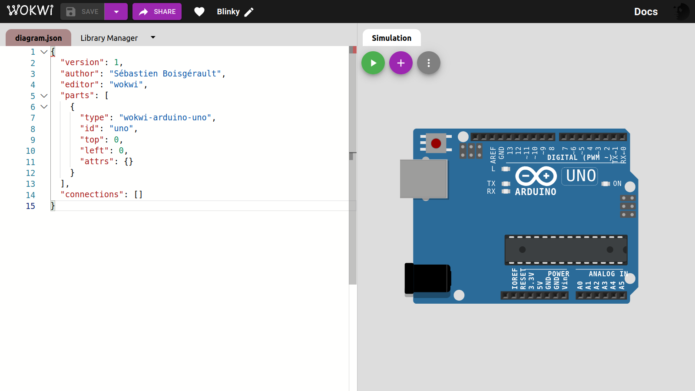
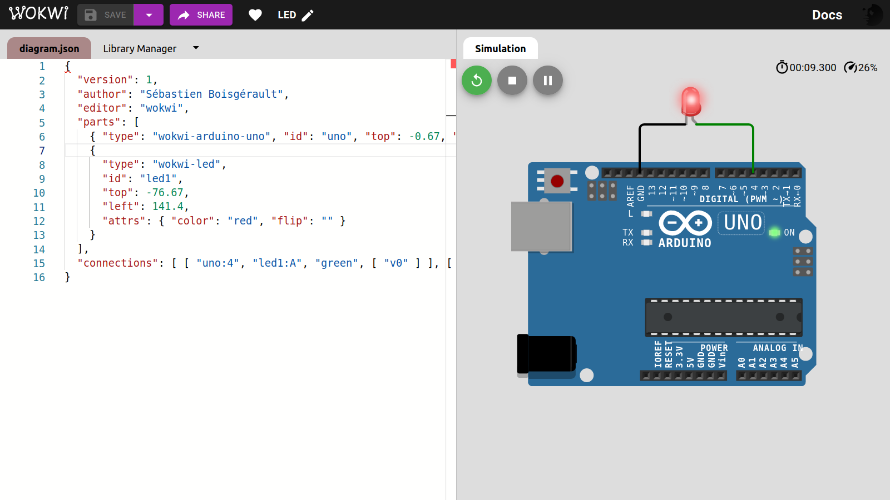
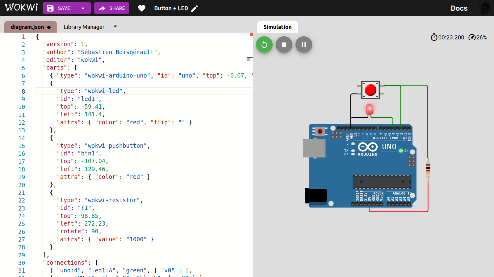
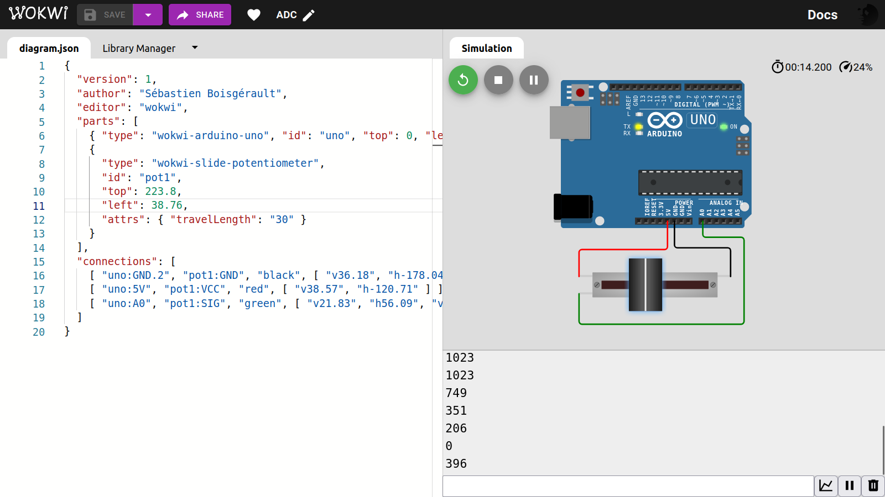
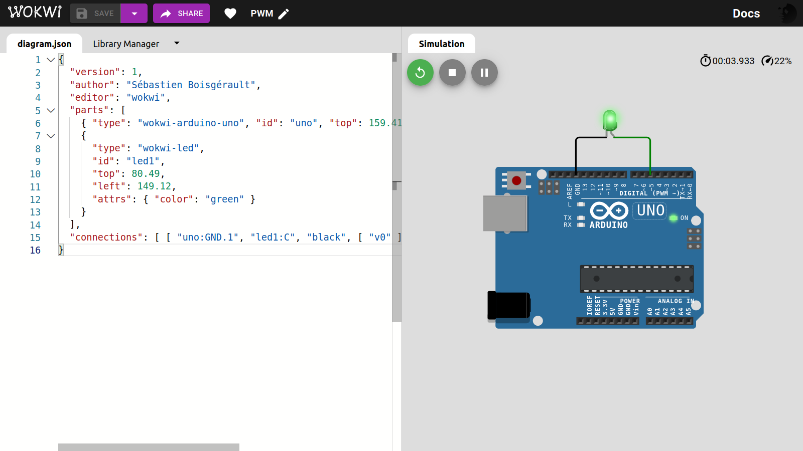

# TinyGo for Arduino Uno

[📖 Introduction](https://boisgera.github.io/tinygo-arduino/slides/index.html)

--------------------------------------------------------------------------------

## Hello world! (PC/Go version)

`app.go`:
```go
package main

func main() {
    println("Hello! 👋")
}
```

Run from source:
```
$ go run app.go
Hello! 👋
```

Compile:
```
$ go build app.go
$ ls
app  app.go
```

Execute:
```
$ ./app 
Hello! 👋
```


File size:
```
$ du -h app
1,2M	app
```

Cross-compile (Windows):
```
$ GOOS=windows go build app.go 
 ls
app  app.exe  app.go
$ du -h app.exe 
1,2M	app.exe
```

Cross-compile (Apple Silicon):
```
$ rm app app.exe
$ ls
app.go
$ GOOS=darwin GOARCH=arm64 go build app.go
$ ls
app  app.go
$ du -h app
1,1M	app
```

## Hello world! (PC/TinyGo version)

`app.go`:
```go
package main

func main() {
    println("Hello! 👋")
}
```

Run from source:
```
$ tinygo run app.go
Hello! 👋
```

Build:
```
$ tinygo build app.go
(base) boisgera@oddball:~/tmp/sandbox$ ls
app  app.go
(base) boisgera@oddball:~/tmp/sandbox$ du -h app
68K	app
```

Execute:
```
$ ./app 
Hello! 👋
```

## Hello world! (Arduino/TinyGo version)

`app.go`:
```go
package main

func main() {
    println("Hello from Arduino! 👋")
}
```

```bash
tinygo flash -target=arduino app.go
```

```
avrdude: AVR device initialized and ready to accept instructions

Reading | ################################################## | 100% 0.00s

avrdude: Device signature = 0x1e950f (probably m328p)
avrdude: NOTE: "flash" memory has been specified, an erase cycle will be performed
         To disable this feature, specify the -D option.
avrdude: erasing chip
avrdude: reading input file "/tmp/tinygo287452646/main.hex"
avrdude: writing flash (1174 bytes):

Writing | ################################################## | 100% 0.20s

avrdude: 1174 bytes of flash written
avrdude: verifying flash memory against /tmp/tinygo287452646/main.hex:
avrdude: load data flash data from input file /tmp/tinygo287452646/main.hex:
avrdude: input file /tmp/tinygo287452646/main.hex contains 1174 bytes
avrdude: reading on-chip flash data:

Reading | ################################################## | 100% 0.16s

avrdude: verifying ...
avrdude: 1174 bytes of flash verified

avrdude done.  Thank you.

```

```bash
pip install pyserial
```


`read.py`:
```python
#!/usr/bin/env python

import serial

BAUD_RATE = 9600
SERIAL_PORT = "/dev/ttyACM0"

with serial.Serial(SERIAL_PORT, BAUD_RATE) as file:
    bytes = file.readline().strip()
    print(bytes.decode("utf-8"))
```

``` bash
$ ./read.py
Hello from Arduino! 👋
```

## Time

`app.go`:
```go
package main

import "time"

func main() {
    for i := 0; i < 3; i++ {
        println("Hello from Arduino! 👋")
        time.Sleep(500 * time.Millisecond)
    }
}
```

`read.py`:
```python
import serial

BAUD_RATE = 9600
SERIAL_PORT = "/dev/ttyACM0"

with serial.Serial(SERIAL_PORT, BAUD_RATE) as file:
    while True:
        bytes = file.readline().strip()
        print(bytes.decode("utf-8"))
```

```bash
tinygo flash -target=arduino app.go
```

```bash
$ ./read.py
Hello from Arduino! 👋
Hello from Arduino! 👋
Hello from Arduino! 👋
```

`app.go`:
```go
package main

import "time"

func main() {
    for {
        println("Hello from Arduino! 👋")
        time.Sleep(500 * time.Millisecond)
    }
}
```

```bash
$ ./read.py
Hello from Arduino! 👋
Hello from Arduino! 👋
Hello from Arduino! 👋
Hello from Arduino! 👋
Hello from Arduino! 👋
...
```

## Blinky


`app.go`:
```go
package main

import (
    "machine"
    "time"
)

var Output = machine.PinConfig{Mode: machine.PinOutput}

func main() {
    led := machine.LED // i.e. machine.D13 (a Pin)
    led.Configure(Output)
    for {
        led.Low()
        time.Sleep(1000 * time.Millisecond)
        led.High()
        time.Sleep(3000 * time.Millisecond)
    }
}
```

```bash
tinygo flash -target=arduino app.go
```

----

ℹ️ To have VS Code recognize the `machine` package that we have used,
ask tinygo about arduino config with `tinygo info arduino`:

```bash
$ tinygo info arduino
LLVM triple:       avr
GOOS:              linux
GOARCH:            arm
build tags:        avr baremetal linux arm atmega328p atmega avr5 arduino tinygo math_big_pure_go gc.conservative scheduler.none serial.uart
garbage collector: conservative
scheduler:         none
cached GOROOT:     /home/boisgera/.cache/tinygo/goroot-be4be59c5e4a687aa60cbb0b4c9469e2512531d5883e254b489df88789874889
```

Then, edit your `.vscode/settings.json` accordingly


`.vscode/settings.json`:
```json
{
    "go.toolsEnvVars": {
        "GOROOT": "/home/boisgera/.cache/tinygo/goroot-1a3665987356bd3f26671cbe3d70be39fe7f2f9bf3a11bacdd5b79ba2096c3c9",
        "GOFLAGS": "-tags=avr,baremetal,linux,arm,atmega328p,atmega,avr5,arduino,tinygo,math_big_pure_go,gc.conservative,scheduler.none,serial.uart"
    }
}
```

For more details, refer to the [TinyGo documentation](https://tinygo.org/docs/guides/ide-integration/vscode/)

# Intel HEX

> **Intel hexadecimal object file format**, Intel hex format or Intellec Hex is a file format that conveys binary information in ASCII text form. It is commonly used for programming microcontrollers, EPROMs, and other types of programmable logic devices and hardware emulators. In a typical application, a compiler or assembler converts a program's source code (such as in C or assembly language) to machine code and outputs it into a HEX file. [...] The HEX file is then read by a programmer to write the machine code into a PROM or is transferred to the target system for loading and execution. 

([Wikipedia](https://en.wikipedia.org/wiki/Intel_HEX))

```bash
tinygo build -o app.hex -target=arduino app.go
```

```
$ cat app.hex
:100000000C9434000C9472020C9472020C947202E0
:100010000C9472020C9472020C9464020C9472029E
:100020000C9472020C9472020C9472020C94720280
...
:10007000BEBF0F92A0E0B3E0C4E6D3E0EEE1F5E04E
:1005700066726F6D2041726475696E6F2120F09F05
:02058000918B5D
:00000001FF
```

```bash
pip install intelhex
```

```bash
$ hexinfo.py app.hex
- file: 'app.hex'
  data:
  - { first: 0x00000000, last: 0x00000581, length: 0x00000582 }
```

```pycon
>>> 0x00000582 
1410
```

(1410 bytes, well below the 32 kb limit for Arduino Uno).

Then instead of `tinygo flash`, do:

```bash
avrdude -C /etc/avrdude.conf -p atmega328p -c arduino -P /dev/ttyACM0 -D -U flash:w:app.hex:i
```

```
$ man avrdude
AVRDUDE(1)                BSD General Commands Manual               AVRDUDE(1)

NAME
     avrdude — driver program for ``simple'' Atmel AVR MCU programmer

SYNOPSIS
     avrdude -p partno [-b baudrate] [-B bitclock] [-c programmer-id]
             [-C config-file] [-D] [-e] [-E exitspec[,exitspec]] [-F]
             [-i delay] [-n -logfile] [-n] [-O] [-P port] [-q] [-s] [-t] [-u]
             [-U memtype:op:filename:filefmt] [-v] [-x extended_param] [-V]
...
```

## WokWi Simulator



 1. Sign into <https://wokwi.com/>.

 2. Start from Scratch with Arduino Uno. You may rename the project "Blinky"
instead of "sketch.ino" and delete the `sketch.ino` file ; we won't need it.

 3. In the editor, right-click and open the command palette (or press F1).

 4. Select "Load HEX File and Start Simulation ..." and upload your `app.hex` file.

 5. Profit! 🎉

 ## LED

To replicate the Blinky project, but with an external LED instead of the 
onboard one, we need little change in the `app.go` program; if we intend
to connect the LED D4, we have:

`app.go`:
```go
package main

import (
    "machine"
    "time"
)

var Output = machine.PinConfig{Mode: machine.PinOutput}

func main() {
    led := machine.D4
    led.Configure(Output)
    for {
        led.Low()
        time.Sleep(1000 * time.Millisecond)
        led.High()
        time.Sleep(3000 * time.Millisecond)
    }
}
```




 ## Toggle Button + LED

To switch the LED state, press the button during at least 0.1 seconds, 
then release it.

```go
package main

import (
    "machine"
    "time"
)

var Input = machine.PinConfig{Mode: machine.PinInput}
var Output = machine.PinConfig{Mode: machine.PinOutput}

var ButtonPin = machine.D2
var ButtonWasPressed = false

var lightPin = machine.D4
var LightOn = false

func setup() {
    machine.LED.Configure(Output)
    ButtonPin.Configure(Input)
}

func ButtonHandler() {
    ButtonPressed := !ButtonPin.Get()
    ButtonRelease := !ButtonPressed && ButtonWasPressed
    if ButtonRelease {
        LightOn = !LightOn
    }
    ButtonWasPressed = ButtonPressed
}

func LightHandler() {
    if LightOn {
        lightPin.High()
    } else {
        lightPin.Low()
    }
}

func main() {
    setup()
    for {
        ButtonHandler()
        LightHandler()
        time.Sleep(100 * time.Millisecond)
    }
}
```




 ## ADC

`app.go`:
```go
package main

import (
    "machine"
    "time"
)

var adc = machine.ADC{Pin: machine.ADC0}

func setup() {
    machine.InitADC()
}

func main() {
    setup()
    for {
        println(adc.Get() >> 6)
        time.Sleep(1 * time.Second)
    }
}
```



`diagram.json`:
```json
{
  "version": 1,
  "author": "Sébastien Boisgérault",
  "editor": "wokwi",
  "parts": [
    { "type": "wokwi-arduino-uno", "id": "uno", "top": 0, "left": 0, "attrs": {} },
    {
      "type": "wokwi-slide-potentiometer",
      "id": "pot1",
      "top": 223.8,
      "left": 38.76,
      "attrs": { "travelLength": "30" }
    }
  ],
  "connections": [
    [ "uno:GND.2", "pot1:GND", "black", [ "v36.18", "h-178.04" ] ],
    [ "uno:5V", "pot1:VCC", "red", [ "v38.57", "h-120.71" ] ],
    [ "uno:A0", "pot1:SIG", "green", [ "v21.83", "h56.09", "v118.38", "h-229.59" ] ]
  ]
}
```

 ## PWM

See [Using PWM](https://tinygo.org/docs/tutorials/pwm/).

⚠️ No floating-point computations!!!

`app.go`:
```go
package main

import (
    "machine"
    "time"
)

var pwm machine.PWM
var pwmPin = machine.D5
var period uint64
var ch uint8

func setup() {
    pwm.Configure(machine.PWMConfig{})
    period = pwm.Period() // 16_000 ns
    var err error
    ch, err = pwm.Channel(pwmPin)
    if err != nil {
        panic(err)
    }
}

func main() {
    setup()
    top := pwm.Top()
    x := top
    for {
        println(x)
        pwm.Set(ch, x)
        x = x - top/100
        if x == 0 {
            x = top
        }
        time.Sleep(10 * time.Duration(period))
    }
}
```



`diagram.json`:
```json
{
  "version": 1,
  "author": "Sébastien Boisgérault",
  "editor": "wokwi",
  "parts": [
    { "type": "wokwi-arduino-uno", "id": "uno", "top": 159.41, "left": 11.03, "attrs": {} },
    {
      "type": "wokwi-led",
      "id": "led1",
      "top": 80.49,
      "left": 149.12,
      "attrs": { "color": "green" }
    }
  ],
  "connections": [ [ "uno:GND.1", "led1:C", "black", [ "v0" ] ], [ "uno:5", "led1:A", "green", [ "v0" ] ] ]
}
```

## Documentation

  - 📖 [TinyGo `machine` package for Arduino Uno](https://tinygo.org/docs/reference/microcontrollers/machine/arduino/).

  - 📖 [Arduino Projects Book](https://github.com/boisgera/tinygo-arduino/raw/master/doc/arduino-projects-book.pdf), license [CC-BY-NC-SA](https://creativecommons.org/licenses/by-nc-sa/3.0/) by Arduino LLC.


