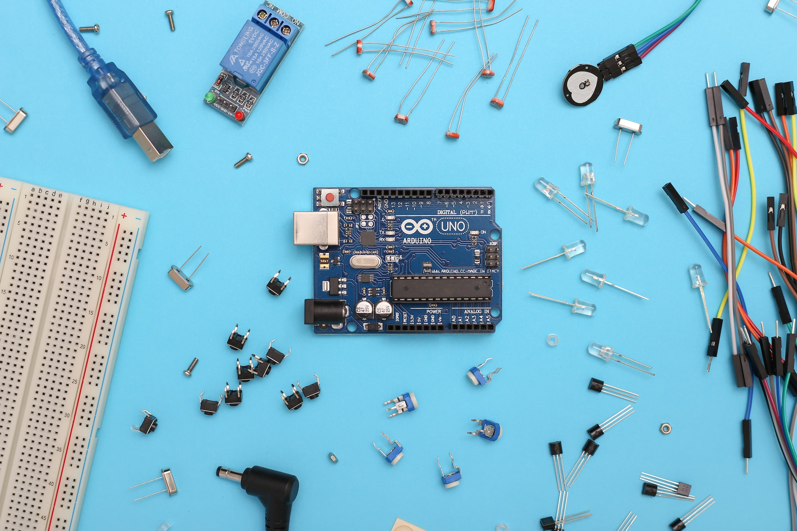
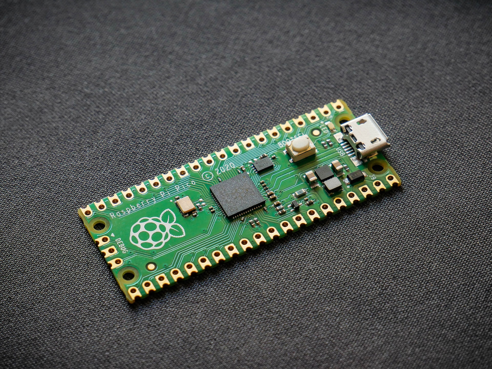

<!-- _color: white -->

# TinyGo & Arduino

## Sébastien Boisgérault –⁠ Mines Paris, PSL

--------------------------------------------------------------------------------

# Arduino

Arduino Uno, microcontroller [ATMega328p (Atmel)](https://ww1.microchip.com/downloads/en/DeviceDoc/Atmel-7810-Automotive-Microcontrollers-ATmega328P_Datasheet.pdf)

  - AVR RISC 8-bit architecture

  - CPU speed: 16 MHz

  - Program memory size: 32KB

  - Data size: ~ 2 KB

--------------------------------------------------------------------------------

# Go (aka Golang)

"Simple, secure, scalable"

  - Open-source (Google)

  - Easy to learn

  - Large standard library

--------------------------------------------------------------------------------

# Good for

  - Tooling & Hackers (Python competitor)

  - Infrastructure & Backend (Java competitor)

  - Distributed & Concurrent Programming, Networking, Cloud-Native Language.

--------------------------------------------------------------------------------

# Company & Products

  - Google, Uber, Twitch, Dropbox, Soundcloud, Alibaba, Paypal, etc.

  - Caddy (HTTP Server), Docker, Pulumi, Kubernetes (containers, cloud/infra managament), Wails (GUI apps), BubbleTea (TUI framework), Badger (database), WebRTC, MQTT (network/protocols), etc.
    

--------------------------------------------------------------------------------

# Positionning

Like Python (high-level, rapid development, ...):

  - List-like and dict-like collections, closures, etc.

  - Fast & fun development cycle

  - Garbage collected

  - "Batteries included"

--------------------------------------------------------------------------------

Like C (efficient, low footprint, ...):

  - Compiled language

  - Static typing

  - Value types & pointers

--------------------------------------------------------------------------------

# TinyGo

**Go compiler for small places**

Microcontrollers (MCU), Consoles, WebAssembly, etc.

--------------------------------------------------------------------------------

# TinyGo

  - Small code/data footprint!

  - Target architectures beyond Linux/Windows/Mac: **AVR**, ARM (Cortex M), 
    RISC-V, XTensa, WebAssembly.

  - `machine` package: support for GPIO, ADC, PWM, etc.

--------------------------------------------------------------------------------

# MCU Programming Languages

  - Assembly (ASM)

  - C

  - C++

  - (Tiny)Go

  -  Python $\to$  [MicroPython](https://micropython.org/)

  - Erlang/Elixir (via AtomVM or Nerves)

  -  [Rust](https://www.rust-lang.org/)

  - Zig

  - ...

--------------------------------------------------------------------------------

# Experiment with TinyGo

  - Simpler than C/ASM (but C interface via CGO?),

  - Leaner and closer to the metal than (micro)Python,

  - Great concurrency model,

  - Positive side-effect for desktop/server development.